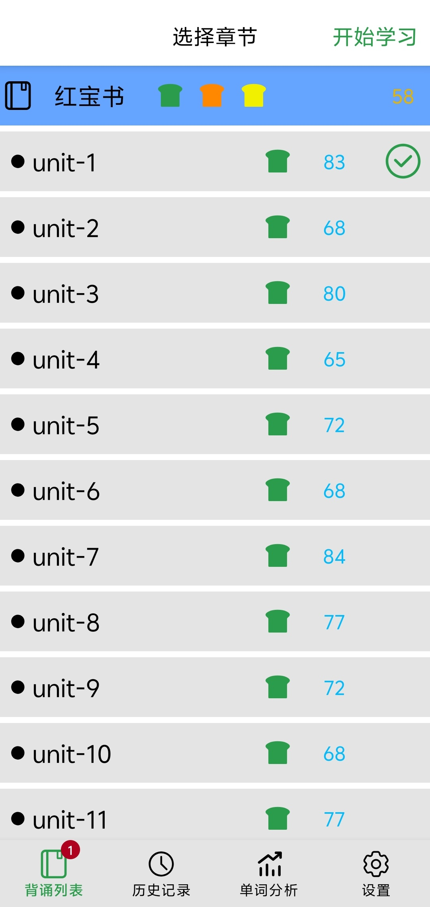
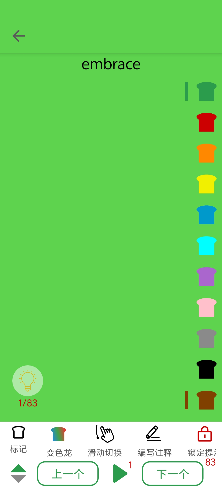
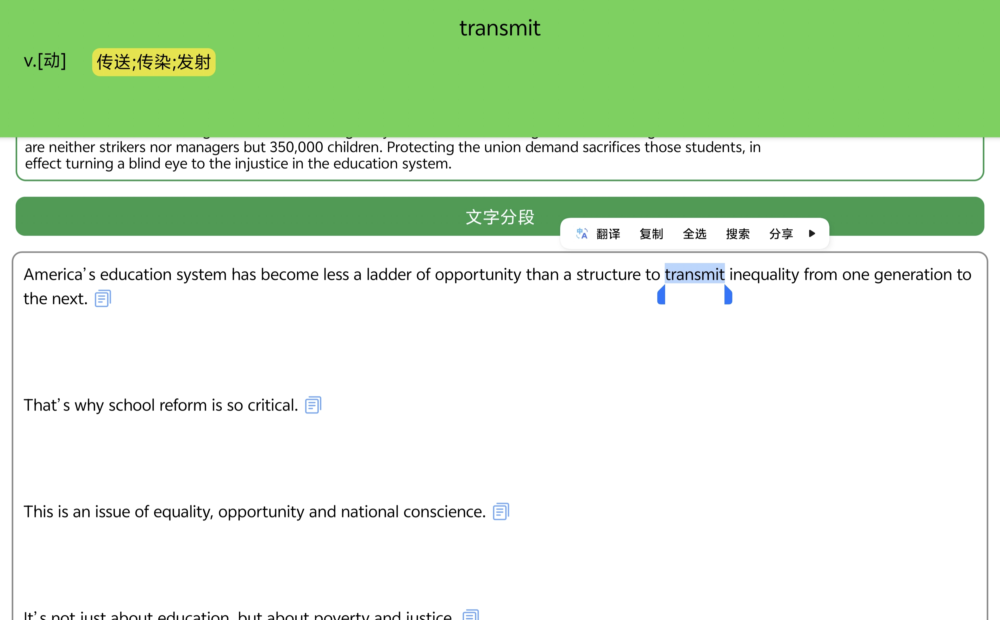

    

<b>WordTint</b>，极简英语背单词学习软件

    

## WordTint  
厌倦了"间隔重复"(SRS)方式的背单词模式来吗?WordTint的理念是"回归基本功",将一切控制权交还给你,选择当前的背诵计划,想背哪个都由你掌控.  
通过标记功能给单词打标签,通过变色龙功能专注某个标签的单词,更多功能联合搭配使用.  

## 软件页面  

    

    

    

